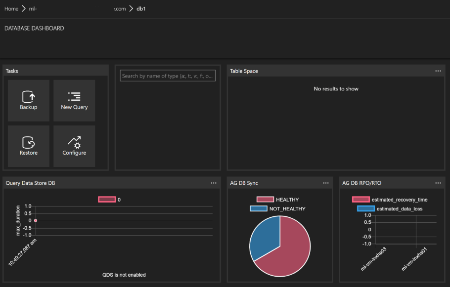

# sqlops-widgets

A collection of SQL Operations Studio Dashboard Widgets.

SQL Operations Studio (sqlopsstudio) is the new cross-platform, cross-database open source tool released by Microsoft. The tool provides the ability to customise the dashboard with different widgets that are either built-in or custom. This project focuses on building some custom widgets to extend the functionality to include important information for DBA's and Developers.

Read more about SQL Operations Studio in the following resources:
[https://blogs.technet.microsoft.com/dataplatforminsider/2017/11/15/announcing-sql-operations-studio-for-preview/](https://blogs.technet.microsoft.com/dataplatforminsider/2017/11/15/announcing-sql-operations-studio-for-preview/)
[https://docs.microsoft.com/en-us/sql/sql-operations-studio/what-is](https://docs.microsoft.com/en-us/sql/sql-operations-studio/what-is)
[https://github.com/Microsoft/sqlopsstudio](https://github.com/Microsoft/sqlopsstudio)

The following example shows the Database Dashboard Wizard configured with some built-in widgets and also our AlwaysOn Database RPO/RTO and Health Widget.



## Insights Included

The following insight packs are included in this project. For more info see the _README.md_ in each insight pack.

* [AlwaysOn-Insights](./alwayson-insights/README.md).

## Change log

A full list of changes in each version can be found in the [change log](./CHANGELOG.md).

## Installation

To install these widgets into your SQL Operations Studio follow these steps.

1. Close SQL Operations Studio if it is already open

1. Download the latest version from the project [releases](https://github.com/Matticusau/sqlops-widgets/releases)

1. Extract the downloaded archive file to a temporary location

1. Copy the various insights packs to your SQL Operations Studio extensions folder. The following example uses PowerShell to copy the files, simply replace the path with the path to you extracted to.

    ```PowerShell
    Set-Location -Path .\PathToExtractedFiles
    Copy-Item -Path * -Destination ~/.sqlops/extensions -Force -Recurse
    ```

1. Open SQL Operations Studio

1. Press F1 (or CTRL+SHIFT+P for those VSCode users) to open the command palette, type "settings" and select *Preferences: Open User Settings*. Alternatively use the File menu to access the settings.

1. The settings screen contains the default settings on the left and your user/workspace settings on the right. Use the Settings search box to locate either "dashboard.server.widgets" or "dashboard.database.widgets" depending on the widget you wish to add.

1. If you haven't modified the default dashboards yet then, hold your mouse cursor over the current configuration and select Pencil/edit icon. This will copy the current settings to your user/workspace settings to allow you to edit them and is the preferred method.

    > The configuration of your user/workspace settings will override the default settings, in the case of the widgets this means you can also remove the built-in widgets from the dashboard if you do not include them in your user/workspace settings.

1. Locate the appropriate section in your user/workspace settings and add the relevate json for the widget you are enabling. The README.md for each insight pack contains the json for enabling the relevant widget. For example the following snippet enables the AG replicate health widget for a server dashboard.

    ```json
    "dashboard.server.widgets": [
        ...
        {
            "name": "AG Replica Health",
            "widget": {
                "ag-replica-health-insight": null
            }
        }
        ...
    ]
    ```

## Bugs / New Features

If you find a bug or have an idea to improve this collection please create a new issue in this project.

## Contributing

You are more than welcoem to help contribute to this project if you wish, please create a new fork of the dev branch, then submit a pull request to the dev branch after making your changes.

## License

This project is released under the [MIT License](https://github.com/Matticusau/sqlops-widgets/blob/master/LICENSE)

## Contributors

* Matticusau [GitHub](https://github.com/Matticusau) | [twitter](https://twitter.com/matticusau)