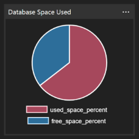
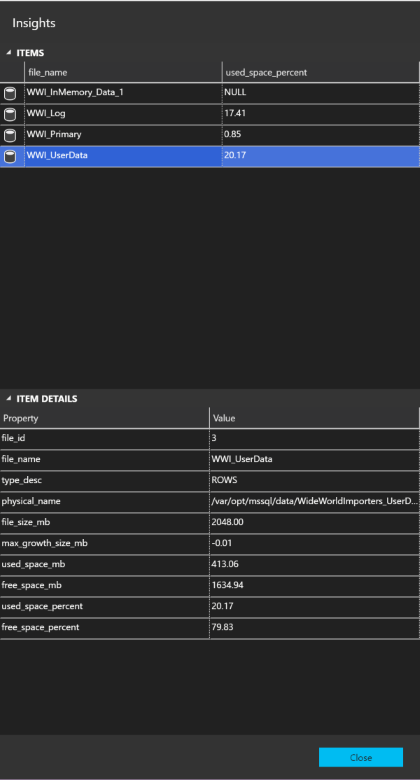
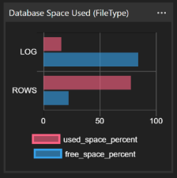

# MSSQL-Database-Insights widget

This collection of widgets are designed to provide insights into MSSQL Database to further extend the built-in default widgets.

Where possible all of these widgets will include more detail when you click *_Show Details_* from the widget menu.


## Supported SQL Server Versions

These widgets have been tested against the following SQL Server versions:

* SQL Server 2016
* SQL Server 2017 (Windows & linux)

If you find any issues using these widgets on these supported SQL Server versions, or any other versions please create an issue as we would like to make these available for as many releases as possible.

***We are looking for testers to confirm other environments.*** So if you find they do work on other releases let me know, and credit will be given.

## mssql-db-spaceused

This Database Dashboard widget includes information on the current used space within a Database. Information will be shown in the form of a pie chart displaying the percentage of used space verses free space.



You can access more information about the space usaged in the detailed fly-out displayed when you select "..." on the widget.



To enable this widget add the following json to either your user or workspace settings in the *dashboard.database.widgets* section.

```json
{
    "name": "DB Space Used",
    "widget": {
        "mssql-db-spaceused": null
    }
}
```

## mssql-db-spaceused-filetype

This Database Dashboard widget includes information on the current used space within a Database broken down by the various file types (ROWS, LOG). Information will be shown in the form of a bar chart displaying the percentage of used space verses free space for each file type.



You can access more information about the space usaged in the detailed fly-out displayed when you select "..." on the widget.


To enable this widget add the following json to either your user or workspace settings in the *dashboard.database.widgets* section.

```json
{
    "name": "DB Space Used (by filetype)",
    "widget": {
        "mssql-db-spaceused-filetype": null
    }
}
```